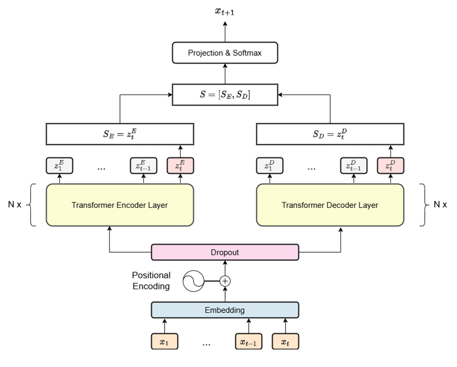

# Recommendation system for e-commerce websites

## Introduce
This is my graduation project on a recommendation system for an e-commerce site. Details of the [backend](https://github.com/shuttfubbb/Backend-for-recommendation-system) and [frontend](https://github.com/shuttfubbb/Frontend-for-recommendation-system).
The recommendation system uses parallel Encoder and Decoder architecture

Encoder-based models are highly suitable for tasks involving understanding and extracting input features, as well as describing the context of tokens within a sequence. Meanwhile, Decoder-based models excel in tasks that involve considering the context of previous tokens in the sequence to generate semantically meaningful text, in this case, predicting the next item in the sequence.  
The goal of this combined model is to leverage the strengths of both approaches. It aims to extract sequential user behavior features within the session using the Local Encoder while also utilizing the Decoder-Only’s ability to predict the next item based on the user’s interaction history. This combination seeks to create a more effective prediction model.

References about [LocalEncoder](https://vjs.ac.vn/index.php/jcc/article/view/15844)

## Hyperparameters

| Hyperparameters information | Value |
| - | :-: |
| batch size | 32 |
| d_model | 64 |
| dim_feedforward    | 512 |
| num tran block  | 2 |
| num head | 2 |
| embedding dropout | 0.25 |
| tran dropout | 0.2 |
| num epochs | 10 |
| learning rate | 0.001 |
| max session len | 20 |

## Result

|Model	|Recall@20|	Recall@10|	Recall@5|	MRR@20	|MRR@10	|MRR@5 |
| - | :-: | :-: | :-: | :-: | :-: | :-: |
|Gru4Rec	|65.67	|54.65	|41.42	|27.08	|26.3	|24.53 |
|Bert4Rec	|67.3	|59.32	|48.8	|34.45	|33.89	|32.46 |
|Local Encoder	|71.2	|60.72	|47.52	|30.86	|30.12	|28.35 |
|Decoder Only	|70.7	|60.11	|46.92	|30.68	|29.93	|28.17 |
|Local Encoder x Decoder	|71.23	|60.52	|47.42	|30.84	|30.08	|28.32 |

## Dataset
[YooChoose](https://www.kaggle.com/datasets/chadgostopp/recsys-challenge-2015)

## How to use
-   Custom your hyperparameters in "train.py" file and run it to train this model.
-   The variable "metric_ks" in the file "test.py" defines the topK list for your Recall and MRR evaluation. Run this file to see the validation.

## Environment
-   pytorch == 2.3.0
-   numpy == 1.24.3
-   tqdm == 4.66.4